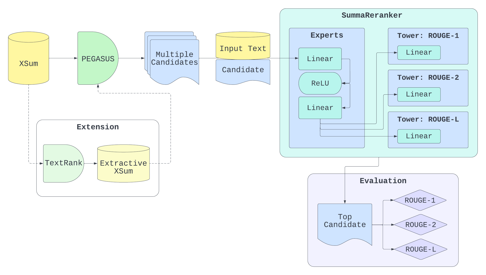

# SummaReranker Replication Project

## Intro
This project explores a second-stage model to re-rank abstractive summary candidates generated with a large pre-trained base model and shows great success in selecting a better candidate, achieving improved performance over an array of metrics. In this paper we look to replicate the SummaReranker model and tackle the limitation of maximum context window for a model encoder by shortening the input text using TextRank. With PEGASUS as our base model and SummaReranker as the second-stage model on our TextRank extractive summary version of the XSum dataset we obtain 55.0 ROUGE-1, 41.5 ROUGE-2, and 54.2 ROUGE-L.

# Secondary Model - SummaReranker
1. Candidate generation
View: dsga-1011-final/CandidatesGeneration/candidate_generation/candidate_vv.ipynb
2. Candidate Scoring
